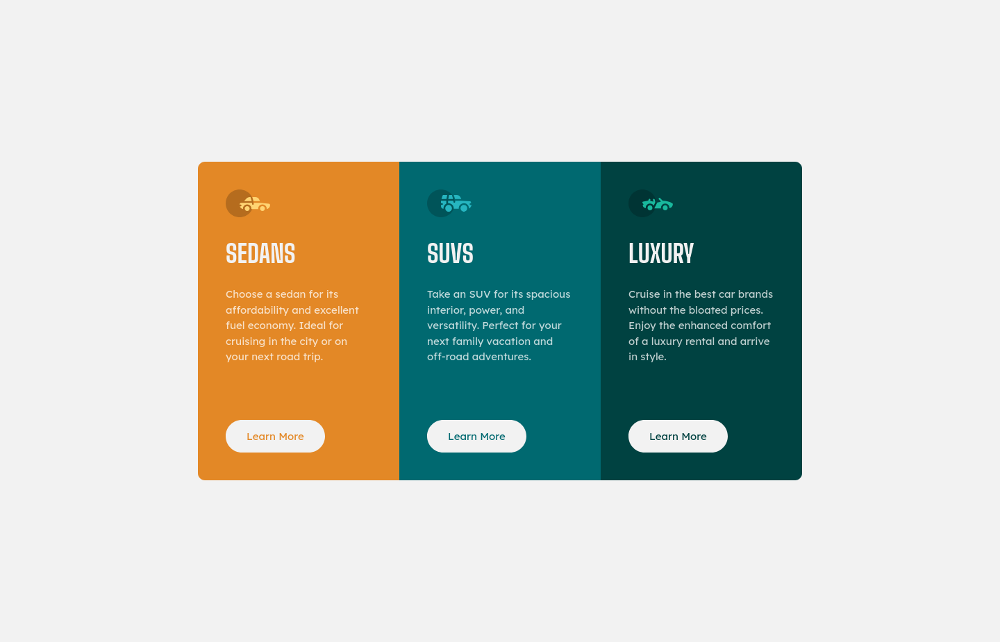

# Frontend Mentor - 3-column preview card component solution

This is a solution to the [3-column preview card component challenge on Frontend Mentor](https://www.frontendmentor.io/challenges/3column-preview-card-component-pH92eAR2-). Frontend Mentor challenges help you improve your coding skills by building realistic projects. 

## Table of contents

- [Frontend Mentor - 3-column preview card component solution](#frontend-mentor---3-column-preview-card-component-solution)
  - [Table of contents](#table-of-contents)
  - [Overview](#overview)
    - [The challenge](#the-challenge)
    - [Screenshot](#screenshot)
    - [Links](#links)
  - [My process](#my-process)
    - [Built with](#built-with)
    - [What I learned](#what-i-learned)
    - [Continued development](#continued-development)
    - [Useful resources](#useful-resources)
  - [Author](#author)

## Overview

### The challenge

Users should be able to:

- View the optimal layout depending on their device's screen size
- See hover states for interactive elements

### Screenshot




### Links

- Solution URL: [https://github.com/juanhastier/3-column-preview-card-component](https://github.com/juanhastier/3-column-preview-card-component)
- Live Site URL: [https://juanhastier.github.io/3-column-preview-card-component](https://juanhastier.github.io/3-column-preview-card-component)

## My process

### Built with

- Semantic HTML5 markup
- CSS custom properties
- Flexbox
- Mobile-first workflow

### What I learned

I learned how to include Google Fonts and use them in my projects

```html
<head>
 <!-- Fonts -->
  <link rel="preconnect" href="https://fonts.googleapis.com">
  <link rel="preconnect" href="https://fonts.gstatic.com" crossorigin>
  <link href="https://fonts.googleapis.com/css2?family=Big+Shoulders:opsz,wght@10..72,700&family=Lexend+Deca&display=swap" rel="stylesheet">
 </head> 
```
```css
.lexend-deca {
  font-family: "Lexend Deca", sans-serif;
  font-optical-sizing: auto;
  font-weight: 400;
  font-style: normal;
}

.big-shoulders {
  font-family: "Big Shoulders", sans-serif;
  font-optical-sizing: auto;
  font-weight: 700;
  font-style: normal;
}
```

### Continued development

For now, I would like to continue my learning path at Frontend Mentor and thus solve increasingly complex challenges.

**Note: Delete this note and the content within this section and replace with your own plans for continued development.**

### Useful resources

- [MDN](https://developer.mozilla.org/en-US/) - TI really enjoyed studying on MDN, and I will continue to use it in the future.
- [CSS Tricks: CSS Flexbox Layout Guide](https://css-tricks.com/snippets/css/a-guide-to-flexbox/) - This is an amazing article which helped me finally understand flexbox layout. I'd recommend it to anyone still learning this concept.
- [CSS Tricks: CSS Grid Layout Guide](https://css-tricks.com/complete-guide-css-grid-layout/) - This is an amazing article which helped me finally understand grid layout. I'd recommend it to anyone still learning this concept.

## Author

- Frontend Mentor - [@juanhastier](https://www.frontendmentor.io/profile/juanhastier)
